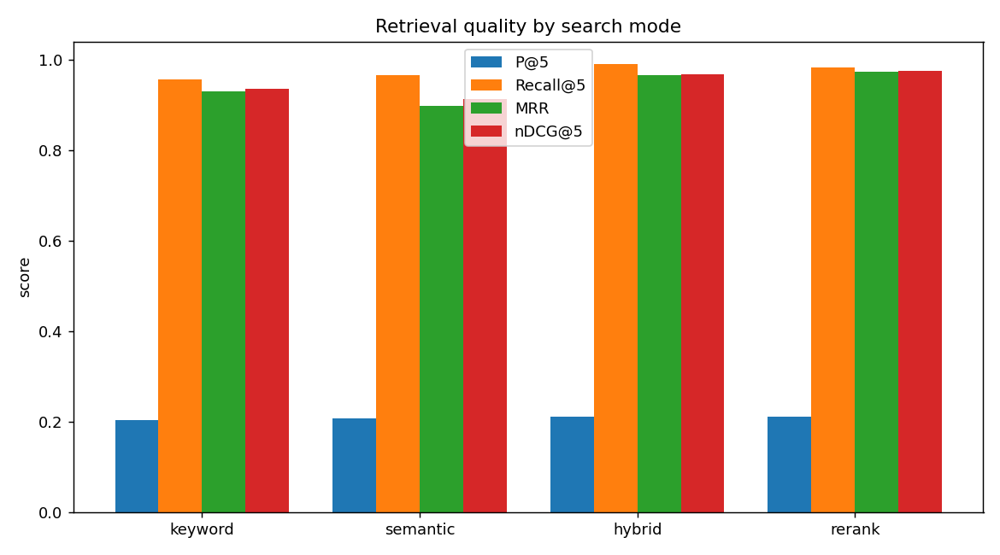
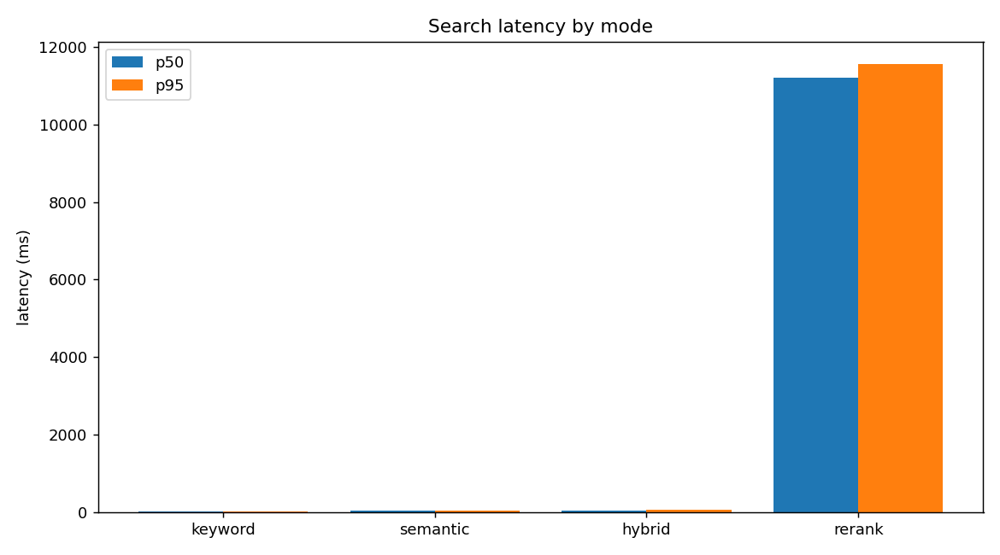
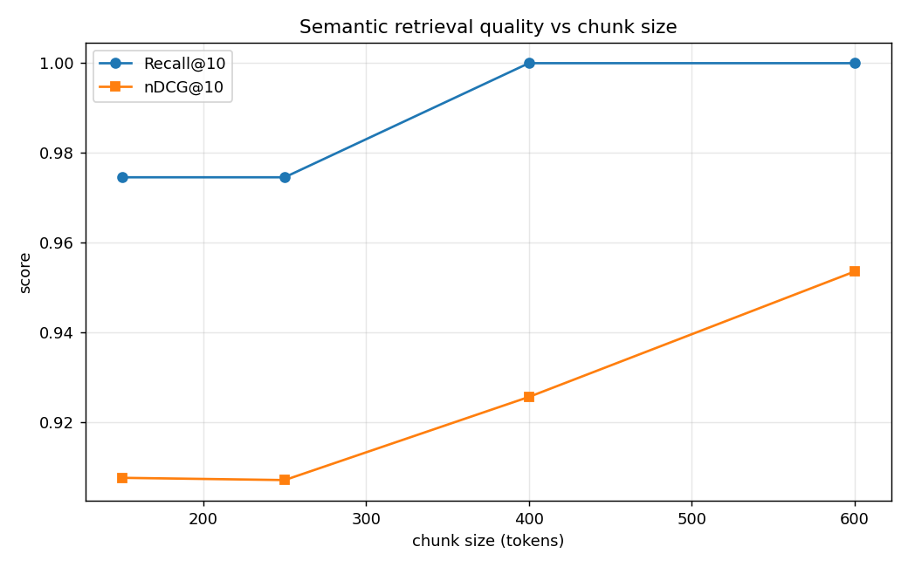

# Document Semantic Search API


> Upload documents, ask questions in plain English, and get the most relevant passages
> back — with **four retrieval strategies benchmarked head-to-head** so every design
> choice is backed by numbers, not intuition.

A document search service that ingests PDFs/text, chunks and embeds them, and serves
**four retrieval modes** — BM25 (lexical), semantic (vector), hybrid (RRF fusion), and
a cross-encoder reranker — behind a FastAPI HTTP API. It ships with a **reproducible
benchmark** that measures the precision, recall, ranking quality, and latency of every
mode on a labeled query set, so the design choices are backed by numbers rather than
intuition.

Built with Python · FastAPI · PostgreSQL (pgvector + ParadeDB/BM25) · Redis · Celery ·
sentence-transformers · a React/Next.js frontend · Docker.

---

## Table of contents

- [Problem statement](#problem-statement)
- [Skills demonstrated](#skills-demonstrated)
- [Architecture](#architecture)
- [Quickstart](#quickstart)
- [API](#api)
- [Frontend](#frontend)
- [Benchmark results](#benchmark-results) ← the core deliverable
- [Chunking strategy](#chunking-strategy)
- [Embedding model choice](#embedding-model-choice)
- [The four search modes](#the-four-search-modes)
- [Design decisions & tradeoffs](#design-decisions--tradeoffs)
- [Design Q&A (anticipated interview questions)](#design-qa-anticipated-interview-questions)
- [Limitations](#limitations)
- [Scaling & future work](#scaling--future-work)
- [Testing](#testing)
- [Project structure](#project-structure)

---

## Problem statement

Keyword search misses meaning ("car" won't match "automobile"); pure vector search
misses exact terms (product codes, error identifiers, rare names). Real systems combine
both. This project implements all the common retrieval strategies **in one system** and,
crucially, **measures them against each other** on a labeled set, so you can see — with
real numbers — where each one wins and what it costs.

The goal was not "a thin wrapper around an embedding API" but a small end-to-end system
that demonstrates: an asynchronous ingestion pipeline, an information-retrieval
evaluation methodology, and the operational concerns (caching, rate limiting,
containerization) of serving it.

---

## Skills demonstrated

| Area | What this project shows |
|---|---|
| **Backend / APIs** | FastAPI, REST design, async vs. sync tradeoffs, dependency injection, request validation |
| **Databases** | PostgreSQL, `pgvector` (HNSW ANN), ParadeDB `pg_search` (BM25), raw SQL + SQLAlchemy, index design |
| **Information retrieval** | BM25, dense embeddings, hybrid fusion (RRF), cross-encoder reranking, retrieve-then-rerank |
| **ML / AI** | sentence-transformers, bi-encoders vs. cross-encoders, embedding normalization, tokenization limits |
| **Evaluation** | Precision/Recall/MRR/nDCG, labelled test set design, hyperparameter sweeps, latency percentiles |
| **Distributed systems** | Celery task queue, Redis broker, background processing, atomic rate limiting via Lua |
| **Systems thinking** | Caching with TTL, fail-open design, one-DB-serves-both, decoupled worker/API |
| **DevOps** | Docker multi-stage builds, docker-compose orchestration, healthchecks, model baking |
| **Frontend** | React/Next.js, Tailwind, client-side data fetching, CORS |
| **Testing** | pytest, unit + integration, dependency mocking, graceful skips |

---

## Architecture

```
                         ┌──────────────────────────┐
   POST /documents ─────▶│   FastAPI (API process)  │
   (PDF / text)          │  • validate, store row   │
                         │  • stage raw bytes        │──┐ enqueue
   GET  /documents/{id} ▶│  • enqueue, return 202    │  │
                         │                           │  │
   POST /search ────────▶│  • rate limit (Redis)     │  │
   (mode, query, k)      │  • cache check (Redis)    │  │
                         │  • embed query, retrieve  │  │
                         └─────────┬─────────────────┘  │
                                   │                     │
          ┌────────────────────────┼─────────────────────┼──────────────┐
          ▼                        ▼                     ▼              ▼
  ┌───────────────┐       ┌────────────────┐    ┌─────────────┐  ┌──────────┐
  │  PostgreSQL   │       │     Redis      │    │   Celery    │  │ Embedding│
  │  + pgvector   │◀─────▶│ cache + broker │◀──▶│   worker    │  │ + rerank │
  │  + pg_search  │       │ + rate-limit   │    │ parse→chunk │  │  models  │
  │               │       └────────────────┘    │ →embed→store│  └──────────┘
  │ documents     │◀───────── bulk insert ──────└─────────────┘
  │ chunks        │
  │  (tsvector,   │   HNSW index (cosine) + BM25 index, same table
  │   vector,bm25)│
  └───────────────┘
```

- **FastAPI** serves the HTTP API. Uploads return `202 Accepted` immediately; the heavy
  work happens off the request path.
- **Celery + Redis** run document ingestion in the background (parse → chunk → embed →
  store), so a multi-page PDF never blocks the upload request.
- **PostgreSQL** with **pgvector** (semantic) and **ParadeDB `pg_search`** (true BM25)
  stores both representations of every chunk in **one database** — no separate search
  engine to operate.
- **Redis** does triple duty: Celery broker/result backend, query-result cache, and the
  token-bucket rate limiter's shared state.

---

## Quickstart

Requires Docker. The app image bakes the models in at build time, so it runs fully
offline afterwards.

> ⏱️ **First build downloads ~4.4 GB** (CPU PyTorch + the `bge-small` and `bge-reranker`
> models) and can take several minutes on a cold machine. Because the models are baked
> into the image, every start afterward is seconds and fully offline.

```bash
# 1. Build (downloads CPU torch + the embedding/reranker models) and start everything
docker compose up -d --build

# 2. Ingest the evaluation corpus (22 short docs about CS/backend/AI topics)
docker compose exec api python -m eval.ingest_corpus --reset

# 3. Open the web UI and search
#    → http://localhost:3000   (the frontend)
#    → http://localhost:8000/docs   (interactive API docs)
curl -s -X POST localhost:8000/search \
  -H 'content-type: application/json' \
  -d '{"query":"why is approximate search faster than brute force","mode":"hybrid","k":5}'
```

`docker compose up -d` starts everything, **including the frontend at
http://localhost:3000**. A `Makefile` wraps the common commands (`make up`,
`make ingest`, `make benchmark`, `make sweep`, `make test`).

---

## API

| Method | Path | Description |
|---|---|---|
| `POST` | `/documents` | Upload a PDF/text file. Returns `202` + a document id. |
| `GET`  | `/documents/{id}` | Ingestion status: `pending → processing → done / failed`. |
| `POST` | `/search` | Search. Body: `{query, mode, k}`. `mode ∈ {keyword, semantic, hybrid, rerank}`. |
| `GET`  | `/health` | Liveness check. |

Interactive docs at `http://localhost:8000/docs`. The search endpoint is rate-limited
(token bucket) and caches identical queries.

---

## Frontend

A React/Next.js web UI (`frontend/`) served at **http://localhost:3000**. It runs the
same query through **keyword, semantic, and hybrid at once**, side by side — so the
core thesis of the project (how the modes differ) is visible in a single screen. It
also supports drag-and-drop upload with live ingestion status.

<!-- To add a screenshot: open http://localhost:3000, run a search, capture with the
     Snipping Tool, and save it as docs/images/frontend.png — then uncomment the line below. -->
<!--  -->

The UI is a separate container that talks to the API over HTTP (CORS-enabled), keeping
frontend and backend cleanly decoupled.

---

## Benchmark results

**This is the core deliverable.** The harness runs every search mode against a labeled
query set and reports ranking-quality metrics plus latency. It is fully reproducible:

```bash
docker compose exec api python -m eval.run_benchmark --k 5 --repeats 1
```

### Methodology

- **Corpus:** 22 short documents (`eval/corpus/`) on adjacent CS/backend/AI topics →
  29 chunks at the default 400-token setting.
- **Queries:** 59 labeled queries (`eval/queries.json`). Each carries **marker phrases**
  planted in the corpus; a retrieved chunk is judged *relevant* iff (after whitespace
  normalization) it contains a marker. This makes relevance reproducible without
  hand-labeling chunk IDs that only exist after ingestion.
- **Metrics:** Precision@5, Recall@5, **MRR**, **nDCG@5**, and latency p50/p95.
- **Hardware:** CPU only, inside Docker (no GPU). Latency is dominated by model
  inference, so absolute numbers are hardware-dependent; the *relative* ordering is the
  point.

### Results (k = 5, 59 queries)

| Mode | P@5 | Recall@5 | MRR | nDCG@5 | p50 (ms) | p95 (ms) |
|---|---|---|---|---|---|---|
| keyword (BM25) | 0.203 | 0.958 | 0.931 | 0.936 | **5.9** | **10.7** |
| semantic | 0.207 | 0.966 | 0.898 | 0.914 | 34.8 | 45.1 |
| **hybrid (RRF)** | 0.210 | **0.992** | 0.967 | 0.968 | 38.3 | 55.1 |
| rerank | 0.210 | 0.983 | **0.975** | **0.977** | 11210.7 | 11564.9 |




### What the numbers say

1. **Hybrid is the best all-rounder.** It has the highest Recall@5 (0.992) and beats
   *both* of its own inputs (BM25 and semantic) on every quality metric, at a modest
   ~35ms. This is concrete evidence that **RRF fusion adds real value** — it isn't
   complexity for its own sake.

2. **The reranker buys quality at a brutal latency cost.** It edges out hybrid on MRR
   and nDCG, but at **~11 seconds per query** on CPU (it runs a full cross-encoder
   forward pass for every candidate). The marginal gain over hybrid (nDCG 0.977 vs
   0.968) is **not worth ~300× the latency** without a GPU or a smaller candidate pool.
   Knowing *when not* to use the fancier method is the point.

3. **Lexical beat semantic here — and that's the interesting finding.** Keyword's MRR
   (0.931) and nDCG (0.936) exceed pure semantic's (0.898 / 0.914). This corpus is dense
   with precise technical terminology, which plays to BM25's exact-match strength;
   semantic search shines on paraphrase, which this set has less of. The lesson:
   **corpus characteristics matter more than the "vectors beat keywords" narrative**,
   and hybrid is robust precisely because it captures both signals.

4. **Precision@5 ≈ 0.20 is expected, not weak.** Most queries have exactly one relevant
   chunk, so Precision@5 is capped at 1/5 = 0.20. The near-0.20 values mean the answer
   is *almost always inside the top 5* — Recall, MRR, and nDCG carry the discriminating
   signal here, which is why they are reported alongside.

---

## Chunking strategy

Implemented in [`app/chunking.py`](app/chunking.py): **recursive, token-aware chunking
with sentence-level overlap**, default **400 tokens / ~60-token overlap**.

- **Why chunk at all?** The embedding model truncates past 512 tokens, and a single
  vector for a long document averages many topics into one blurry representation that
  retrieves poorly.
- **Why recursive (paragraph → sentence → word)?** Splitting on natural boundaries keeps
  each chunk semantically coherent instead of cutting mid-thought. Coherent chunks →
  cleaner embeddings → better recall.
- **Why token-aware, not character-aware?** The model's limit is in *tokens*. Chunking
  is measured with the model's own tokenizer so what's stored matches what the model can
  actually encode.
- **Why ~60-token overlap?** A fact split across a boundary would otherwise be lost from
  both chunks. Overlap keeps boundary-spanning content retrievable, at ~15% extra rows.

### Why 400 tokens — measured, not guessed

The chunk size is a tuned hyperparameter. `eval/chunk_sweep.py` re-chunks the corpus at
several sizes and evaluates semantic retrieval in isolation:



| Chunk size | # chunks | Recall@10 | nDCG@10 |
|---|---|---|---|
| 150 | 69 | 0.975 | 0.908 |
| 250 | 44 | 0.975 | 0.907 |
| **400** | 29 | 1.000 | 0.926 |
| 600 | 22 | 1.000 | 0.954 |

At first glance 600 looks best — **but that's a trap, and explaining it is the point.**
bge-small's maximum input is **512 tokens**, so 600-token chunks are **silently
truncated** at embedding time; they only "win" here because the truncated text happened
to retain the answer on this small corpus. **400 tokens is the largest size that stays
safely under the 512 cap** (after the query prefix and special tokens) while maximizing
context — so it's the principled choice, balancing retrieval quality against embedding
fidelity and keeping returned passages focused.

---

## Embedding model choice

**`BAAI/bge-small-en-v1.5`** (384-dim, ~33M params, MIT license) for retrieval, plus
**`BAAI/bge-reranker-base`** (cross-encoder) for the rerank mode.

- **Local & reproducible:** both run on CPU, no paid API, baked into the Docker image.
- **384 dims** keeps the HNSW index and rows small → faster, lighter than 768-dim models,
  with competitive MTEB retrieval scores. (`all-MiniLM-L6-v2` is the well-known baseline;
  bge-small scores higher at the same size.)
- **The asymmetry gotcha:** bge stores passages raw but requires queries to be prefixed
  with `"Represent this sentence for searching relevant passages: "`. Getting this wrong
  silently degrades recall — handled in [`app/embeddings.py`](app/embeddings.py).
- **Normalized embeddings** so cosine similarity reduces to a dot product (see
  [distance metrics](eval/corpus/22_distance_metrics.md) in the corpus).

---

## The four search modes

Implemented in [`app/search.py`](app/search.py):

- **keyword** — true **BM25** via ParadeDB `pg_search` (`paradedb.match` + `@@@`). Wins
  on exact terms; ~5ms.
- **semantic** — pgvector **HNSW** cosine search over normalized bge-small embeddings.
  Wins on paraphrase.
- **hybrid** — pulls top-N from BM25 *and* semantic, fuses with **Reciprocal Rank Fusion**
  (`score = Σ 1/(k + rank)`, k=60). RRF needs **no score normalization** — BM25 scores
  and cosine similarities are on incomparable scales, so it fuses on *rank*, not score.
- **rerank** — a **cross-encoder** re-scores a **high-recall union** of BM25's and
  semantic's candidates (not hybrid's fused top-k), then returns the top k. Most
  accurate per pair, but can't be precomputed, so it's a second-stage reranker only.
  Reranking the *fused* list would inherit RRF's failure to surface a strong
  single-signal match — see [Design decisions](#design-decisions--tradeoffs).

---

## Design decisions & tradeoffs

| Decision | Why | Tradeoff accepted |
|---|---|---|
| **ParadeDB for true BM25** | Real BM25, not an approximation; stays inside Postgres so one DB serves both retrieval types. | Custom Postgres image instead of stock pgvector. |
| **RRF for hybrid** | No score normalization needed; robust; industry standard. | Ignores score *magnitude* (only rank) — fine in practice. |
| **Sync SQLAlchemy** | The bottleneck is CPU-bound embedding, not DB I/O; async would add complexity for ~no gain. | Endpoints run in a threadpool rather than fully async. |
| **Token bucket via Redis Lua** | The refill+spend must be **atomic** across instances or two requests race. A Lua script runs atomically server-side. | One more moving piece than an in-process limiter. |
| **Fail-open rate limiting** | For a search API, availability beats strict enforcement during a Redis outage. | A Redis outage temporarily disables limiting. |
| **Cache key = hash(query+mode+k), TTL** | Identical searches hit; TTL bounds staleness with no explicit invalidation. | Results can be up to TTL seconds stale after new ingests. |
| **Models baked into the image** | Instant startup, fully offline/reproducible runs. | Larger image (~4.4GB). |
| **Raw bytes via shared volume, not the broker** | Brokers are for small messages, not file payloads. | Requires a shared volume between api and worker. |
| **Reranker shipped but shown to be slow** | Demonstrates retrieve-then-rerank; the benchmark quantifies *why* it's situational. | ~11s/query on CPU — not for production without a GPU. |
| **Rerank over a high-recall candidate union** | A reranker can only reorder what it's given; reranking hybrid's *fused* top-k lets RRF drop a strong single-signal match before the cross-encoder sees it. Found this via testing (a semantic-only match the reranker couldn't recover) and switched to a union of both retrievers' candidates. | More candidates → higher rerank latency. |
| **RRF can be misled by lexical noise** | Documented limitation, not hidden: a spurious BM25 match (no stopword filtering) can be *rewarded* by RRF for cross-ranker "agreement," out-voting a correct semantic-only hit. Mitigation is the rerank mode; a further fix is stopword/stemming config on the BM25 tokenizer. | Hybrid isn't universally best — which is *why* four modes exist. |

---

## Design Q&A (anticipated interview questions)

**Why PostgreSQL + pgvector instead of a dedicated vector database (Pinecone, Weaviate, Milvus)?**
One database serves *both* semantic and lexical search, so there's no second system to
deploy, back up, or keep in sync — the chunks, their embeddings, and their BM25 index
all live in the same row. For a corpus that fits comfortably in Postgres, this is
simpler and cheaper. I'd reach for a dedicated vector DB only at a scale where Postgres'
ANN throughput becomes the bottleneck (see [Scaling](#scaling--future-work)).

**Why ParadeDB `pg_search` for BM25 instead of Elasticsearch/OpenSearch?**
Same reasoning — it keeps lexical search *inside* Postgres rather than running and
syncing a separate Elasticsearch cluster. It gives real BM25 (not just Postgres'
`ts_rank`), so I can honestly say the keyword mode is BM25, and the two retrievers share
one source of truth.

**Why Celery + Redis instead of FastAPI `BackgroundTasks`?**
`BackgroundTasks` run *in the API process* — a crash or restart loses the work, and
heavy CPU jobs still compete with request handling. Celery runs ingestion in a separate,
independently scalable worker, with durable queuing (the task survives if no worker is
up) and retries. That's the difference between a demo and something you'd actually
operate. If a worker is killed mid-task, Redis redelivers the unacked task after the
configured 5-minute visibility timeout.

**Why Reciprocal Rank Fusion for hybrid instead of a weighted score sum?**
BM25 scores and cosine similarities live on completely different scales, so a weighted
sum needs fragile per-corpus normalization. RRF fuses on *rank* instead of score, needs
no normalization, and is the current industry default. I note its weakness honestly: it
can reward a spurious lexical match for cross-ranker agreement (see the last row above).

**Why `bge-small` instead of a bigger model or a hosted embedding API (e.g. OpenAI)?**
It's local, free, MIT-licensed, and CPU-friendly, so the whole project is reproducible
with no API keys or per-call cost — a hard requirement here. At 384 dims it keeps the
index small and fast while scoring competitively on MTEB. `bge-base` (768-dim) is a
drop-in upgrade if quality needs to rise; a hosted API would trade reproducibility for a
quality bump.

**How do you know the search is actually good — not just "looks fine"?**
That's the whole point of the [benchmark](#benchmark-results): a labelled query set and
real metrics (Recall, MRR, nDCG, latency) computed per mode. I don't claim hybrid is best
— I *measured* it, found the counterintuitive result that BM25 beat semantic on this
corpus, and can explain why.

**What was the hardest bug?**
The reranker silently returned wrong results on a query where semantic alone was correct.
The cross-encoder was fine in isolation (I verified: 0.997 for the right passage) — the
real cause was upstream: it only re-scored the *fused hybrid* candidates, so a strong
semantic-only match was voted below the cutoff before the reranker ever saw it. Fix: rerank
a **high-recall union** of both retrievers. A reranker can only reorder what it's given.

**What would you do differently / what are the weaknesses?**
BM25 has no stopword/stemming filter yet (a query stopword caused a spurious match) —
fixable via the ParadeDB tokenizer config. The reranker is impractical on CPU (~11s/query);
it needs a GPU or a smaller candidate pool. And chunk size is tuned on one small corpus —
I'd re-sweep it per dataset rather than assume 400 is universal.

---

## Limitations

Honest boundaries of this project as it stands — stated up front because knowing them is
part of the design:

- **Small evaluation corpus.** Metrics are computed on 22 documents / 59 labeled queries.
  They validate *relative* mode behavior and catch regressions; they are **not** a claim
  about large-corpus quality.
- **Reranker is impractical on CPU** (~11 s/query — a full cross-encoder pass per
  candidate). It ships to demonstrate retrieve-then-rerank; it needs a GPU or a smaller
  candidate pool for real use.
- **BM25 has no stopword/stemming filter yet**, so a spurious common-word match can mislead
  the hybrid fusion. Fixable via the ParadeDB tokenizer config.
- **Chunk size (400 tokens) is tuned on this one corpus** — re-sweep per dataset rather than
  assuming it transfers.
- **Single-tenant demo:** no authentication or per-user document scoping; anyone with API
  access sees all documents.
- **Rate limiter fails open:** during a Redis outage, limiting is disabled (availability
  chosen over strict enforcement).
- **Benchmark latencies are CPU/hardware-dependent** (measured in Docker, no GPU); the
  *ordering* across modes is the portable finding, not the absolute milliseconds.

## Scaling & future work

**Where it would break first, and what I'd do:**

- **ANN throughput** — at millions of vectors, Postgres HNSW query latency and memory grow.
  First lever: `pgvector` HNSW tuning (`ef_search`) and quantized/`halfvec` embeddings; past
  that, a dedicated vector store (Milvus/Qdrant) for the ANN tier while keeping metadata in
  Postgres.
- **Ingestion volume** — Celery already scales horizontally; I'd add more workers, batch
  embeddings on a GPU, and stream large PDFs rather than loading them whole.
- **Reranker latency** — move the cross-encoder to a GPU, shrink the candidate pool, or make
  rerank an opt-in "high precision" toggle rather than a default.
- **BM25 quality** — configure the ParadeDB tokenizer with English stemming + stopword
  removal to kill spurious common-word matches.
- **Observability** — structured request logging, per-mode latency metrics, and tracing so
  regressions surface in production (the corpus even documents the pattern).
- **Nice-to-haves** — answer generation on top of retrieval (RAG), per-user document
  scoping + auth, and a CI pipeline that runs the benchmark on every change to catch
  quality regressions.

---

## Testing

```bash
docker compose exec api pytest
```

- **Unit** (run anywhere): benchmark metrics, the chunker's token-budget invariant and
  overlap, the BM25 query sanitizer, cache-key normalization.
- **Integration** (`integration` marker): FastAPI `TestClient` for the upload→202 flow
  (the Celery task is monkeypatched, so no worker is required), validation, and 404s.
- Tests **skip cleanly** when an optional dependency or Postgres isn't available, so the
  suite never fails just because the environment is incomplete.

---

## Project structure

```
app/
  main.py            FastAPI app
  config.py          all settings (model, chunking, limits) in one place
  models.py          Document + Chunk tables (UUID, status, Vector(384))
  chunking.py        recursive token-aware chunker
  embeddings.py      bge-small loader (passage vs query encoding)
  parsing.py         PDF + text extraction
  tasks.py           Celery ingestion task
  search.py          the four search modes
  reranker.py        cross-encoder
  cache.py           Redis TTL query cache
  ratelimit.py       token-bucket limiter (atomic Lua)
  routers/           documents + search endpoints
scripts/init_db.py   extensions + tables + HNSW/BM25 indexes
eval/
  corpus/            22 labeled documents
  queries.json       59 labeled queries
  metrics.py         P@k, Recall@k, MRR, nDCG@k
  run_benchmark.py   the 4-mode benchmark
  chunk_sweep.py     chunk-size experiment
tests/               unit + integration
frontend/            React/Next.js UI (upload + side-by-side mode comparison)
  app/               pages + layout
  components/        UploadPanel, ModeColumn
  lib/api.js         API client
Dockerfile · docker-compose.yml · Makefile
```

---

## License

MIT — see [LICENSE](LICENSE).

> Note: benchmark numbers were measured on CPU inside Docker (no GPU), so absolute
> latencies are hardware-dependent; the *relative* ordering across modes is the point.
