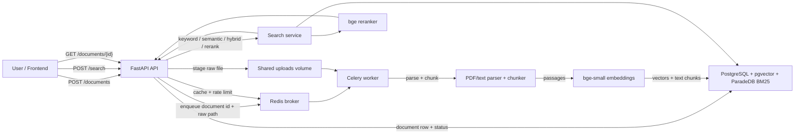

# Architecture Diagram

Proposed Mermaid diagram for the README after human approval.

Operational notes:

- Uploads return `202` quickly; ingestion is handled by Celery off the request path.
- Redis is used for queueing, cache, and the atomic token-bucket rate limiter.
- PostgreSQL is the single source of truth for document metadata, chunks, vectors, and BM25.
- Worker crash recovery depends on late acknowledgements, `prefetch=1`, and Redis visibility timeout redelivery.
